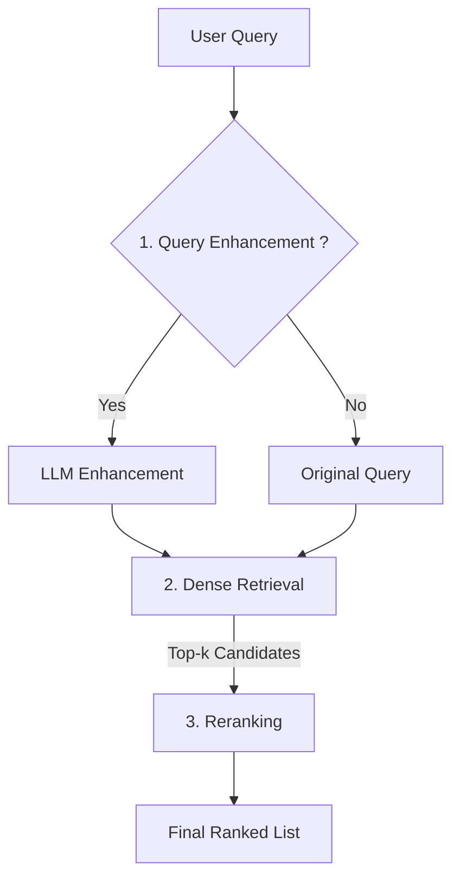

## Medical Semantic Search System

Important note: this public repository is a clean-room, open-source proof-of-concept(PoC) that demonstrates an end-to-end search pipeline, including query enhancement, dense retrieval, and reranking, using only publicly available datasets. This project is independently developed for research use as a reference architecture; it is not for clinical use and includes no employer-specific code, configurations, or data.

For convenience, the project supports two execution modes:

- Sample (demo): processes the first 1,000 documents by default (controlled via `MAX_DOCS`).
- Full (experiments): processes the entire dataset;evalutation metrics (nDCG@k, P@k, R@100, MAP) are calculated using the `ir-measures` package and summarized in a table.

On first run, the dataset (PubMed Central TREC CDS 2016 — see [ir-datasets — pmc/v2/trec-cds-2016](https://ir-datasets.com/pmc.html)) will be downloaded automatically.


### Public Substitute Dataset

- PubMed Central TREC CDS 2016
  - Documents: ~1.3M (PMC v2)
  - Queries: 30
  - Qrels: ~38K
  - See the dataset page for Python API / CLI / PyTerrier examples.
  - Link: [ir-datasets — pmc/v2/trec-cds-2016](https://ir-datasets.com/pmc.html)

The download time will depend on your network and disk speed. The total dataset size is approximately 33GB, though the exact size may vary depending on the mirror and compression format used. To ensure license compliance and experimental reproducibility, this project exclusively uses the official PMC open-access snapshot and download links specified by TREC CDS, and does not repackage or redistribute the original documents.


### System Architecture and Pipeline

End-to-end flow:

1. Enhance Query (optional, controlled by `ENHANCE_QUERY`): rewrite the user query via an Ollama `/api/chat` endpoint to improve semantic retrieval. For instance, a simple query like "Search for all cases of HIV brain disease" is transformed into a comprehensive, expert-level query like "Search for Brain MRI reports with findings consistent with HIV-related brain lesions, including basal ganglia lesions, opportunistic infections (e.g., toxoplasmosis, PML), HIV encephalopathy, or CNS lymphoma."

2. Dense Retrieval: build a FAISS index over document embeddings generated by a Hugging Face model and perform a cosine-similarity search with the query embedding to obtain the top-k candidates.

3. Rerank: rerank top-k candidate documents with a cross-encoder to produce the final ranking.

<div align="center">



</div>

### Project Structure

```
.
├── docker/
│   └── Dockerfile
├── scripts/
│   └── main.py            # entrypoint (calls src.cds2016.cli)
├── src/
│   └── cds2016/
│       ├── cli.py         # CLI pipeline
│       ├── config.py      # configuration (env overrides supported)
│       ├── data.py        # ir-datasets loading
│       ├── embeddings.py  # embeddings for queries/documents
│       ├── enhance.py     # query enhancement (LLM endpoint)
│       ├── index.py       # FAISS index build/load/search
│       ├── search.py      # dense search and BM25 hook
│       ├── rerank.py      # cross-encoder
│       └── evaluate.py    # metrics
├── docker-compose.yml
├── requirements.txt
└── LICENSE
```


### Quick Start

This section guides you through setting up and running the project. Choose either Pip or Docker.

**Prerequisites**
- Python 3.11.13
- CUDA 12.4 (for GPU support). Ensure a compatible CUDA driver is installed on the host machine.

#### Option A: Pip Installation

1.  **Set up environment variables**

    First, copy the example environment file. You can customize variables like model names or file paths in `.env`.
    ```bash
    cp .env.example .env
    ```

2.  **Install dependencies**
    ```bash
    pip install -r requirements.txt
    ```

3.  **Run the pipeline**
    ```bash
    # Standard run
    python scripts/main.py

    # Verbose run
    python scripts/main.py -v
    ```

#### Option B: Docker (Recommended)

This method uses Docker Compose to manage the environment and dependencies. See the "Containerized Setup" section for more options.

1.  **Set up environment variables**

    First, copy the example environment file. Docker Compose will automatically load it.
    ```bash
    cp .env.example .env
    ```

2.  **Build and run the container**

    This command builds the image and runs the main script. The `--rm` flag cleans up the container after execution.
    ```bash
    docker compose build
    docker compose run --rm app python scripts/main.py
    ```
    To run with verbosity:
    ```bash
    docker compose run --rm app python scripts/main.py -v
    ```

### Configuration Notes

#### Logging Behavior
- Default (no flags): level is INFO; printed to console only.
- With `-q` (quiet): level is WARNING (show WARNING/ERROR only); printed to console only.
- With `-v` (verbose): level is DEBUG; printed to console and also written to `./logs/cds2016_YYYYMMDD_HHMMSS.log`.

#### FAISS package: GPU/CPU switch

Default is GPU (`faiss-gpu-cu12`) via `requirements.txt`.

- CPU-only environments:

```bash
pip uninstall -y faiss-gpu-cu12 faiss-gpu
pip install -U faiss-cpu
```

- Switch back to GPU:

```bash
pip uninstall -y faiss-cpu
pip install -U faiss-gpu-cu12==1.8.0.2
```

Note: `faiss-gpu` does not automatically fall back to CPU if CUDA/GPU is unavailable. Ensure a compatible NVIDIA driver and CUDA for the pinned build.

Environment variables via .env (see .env.example for the full list and defaults):

```dotenv
# Data and outputs
DATASET_ID=pmc/v2/trec-cds-2016
FAISS_DIR=./artifacts/cds2016_faiss
MAX_DOCS=1000

# Models
EMBED_MODEL=Qwen/Qwen3-Embedding-8B
EMBEDDING_BATCH=2
RERANK_MODEL=BAAI/bge-reranker-v2-gemma
RERANK_METHOD=gemma
RERANK_BATCH=16

# Retrieval
RETRIEVAL_TOPK=1000
RERANK_K=1000
FINAL_K=100
EVAL_AT=10

# Device
DEVICE=cuda

# (optional) Query enhancement (Ollama /api/chat endpoint)
ENHANCE_QUERY=false
ENHANCE_ENDPOINT=http://localhost:11434/api/chat
ENHANCE_MODEL=medgemma-27b-text-it:latest
```


### GPU acceleration (NVIDIA)

This project can leverage GPUs via Hugging Face Accelerate sharded loading (`device_map=auto`) for embedding and reranking models. FAISS GPU search currently uses a single device by default in this repo.

Requirements:

- Install GPU toolkits and drivers (CUDA) compatible with your PyTorch/FAISS builds
- At least one visible GPU (check with `nvidia-smi`)

How it works:

- When `DEVICE` is set to `cuda` or `gpu`, CUDA is available, and Accelerate is installed, the code sets `device_map=auto` so embedding and reranking models can shard across GPUs; otherwise `device_map` is not set and the model is moved to the specified device.
- FAISS: the index builder tries to place the index on a single GPU. If OOM occurs, it falls back to CPU. Multi-GPU FAISS is possible but not enabled here to keep the demo simple.


Notes:

- If Accelerate is not installed, sharding is disabled automatically; the model uses a single device.
- If you see Flash Attention errors, the loader will retry without FA2; performance may change.
- Using a BF16-capable GPU is recommended for large models; otherwise, the process will fall back to FP16.
- Reranking is the heaviest stage. Start from a small `RERANK_BATCH` and scale up.
- When a FAISS operation causes an out-of-memory error, the process will automatically fall back to the CPU.


### Containerized Setup (Docker & Compose)

Start a container and run the pipeline:

```bash
# start container (detached)
docker compose up -d

# enter the container shell
docker compose exec app bash

# inside the container
python scripts/main.py -v
```

One-shot (non-interactive):

```bash
docker compose run --rm app python scripts/main.py -v
```

GPU selection via compose (excerpt from `docker-compose.yml`):

```yaml
deploy:
  resources:
    reservations:
      devices:
        - driver: nvidia
          count: all  # or device_ids: ["0", "1"]
          capabilities: [gpu]
```

Environment & caches (defined in `docker-compose.yml`):

- `.env` is loaded via `env_file: .env` (see `.env.example`)
- `HF_HOME`, `TORCH_HOME`, `KERAS_HOME` redirected to `/data/.cache` for shared caching
- Volumes:
  - `.:/workspace` live-mount the code
  - `./data/.ir_datasets:/root/.ir_datasets` for ir-datasets cache
  - `/data/.cache:/data/.cache` for model and dataset caches

Notes:

- If the container logs show GPU-related errors, verify NVIDIA toolkit installation and that the listed GPU IDs are present (`nvidia-smi`).
- The compose GPU block may require a recent Docker/Compose. If unsupported in your environment, use a single-GPU setup or run with `docker run` and `--gpus` flags.


### Evaluation and Results

The Command-Line Interface (CLI) prints evaluation metrics for each pipeline stage (e.g., Dense Search, Rerank). In our experiments, we compared several reranker models, including `BAAI/bge-reranker-v2-gemma`, `ncbi/MedCPT-Cross-Encoder`, and `Qwen/Qwen3-Reranker-8B`. This configuration defaults to using `BAAI/bge-reranker-v2-gemma`, which yielded the best performance.


#### Results

Note: The following results are from the full dataset; all values are percentages (%), shown with two decimal places; '(enhanced)' indicates query enhancement is used.

```text
| Method                               | nDCG@10 |  P@10  |  R@100  |  MAP   |
|--------------------------------------|---------|--------|---------|--------|
| Dense Search                         |  24.69  |  30.33 |  12.87  |  3.32  |
| Dense Search (enhanced)              |  22.02  |  27.00 |  13.34  |  3.42  |
| Rerank of Dense Search               |  20.33  |  23.33 |  13.37  |  3.64  |
| Rerank of Dense Search (enhanced)    |  20.31  |  25.00 |  13.52  |  3.60  |
```


#### Discussion

- **Metric Evaluation**: Dense Search demonstrates superior top-10 ranking quality (nDCG@10, P@10) compared to the reranked version. However, reranking yields a slight improvement in overall recall (R@100) and MAP.
- **Impact of Query Enhancement**: Query enhancement effectively broadens the search scope, boosting R@100 and MAP. However, it also introduces noise, which degrades the precision of top-ranked results (nDCG@10, P@10) during the dense retrieval stage.
- **Limitations and Potential Factors**:
  - A discrepancy exists between the public test set queries (long, expert-phrased sentences) and real-world clinical queries (often short and ambiguous). Consequently, the quantitative metrics may not fully capture the practical benefits of query enhancement.
  - A domain gap between the cross-encoder's pre-training data and the medical corpus compromises the precision of top-ranked results, leading to a decline in metrics like nDCG@10.


### TODO (Future Work)

- **Integrate BM25 Retrieval**:
  - Beyond the existing vector-based dense retrieval, we will add a keyword-based BM25 retrieval path. The current codebase includes a basic interface for `pyserini`, but an index creation process has not yet been implemented.

- **Implement RRF (Reciprocal Rank Fusion) for Hybrid Ranking**:
  - Develop an RRF fusion mechanism to combine ranking results from multiple sources (e.g., Dense Search, BM25, and their respective query-enhanced versions) into a single, more robust ranking.


### Privacy and Compliance

- This project is an independently developed demonstration. Its pipeline and architecture serve as a production-ready reference for clinical search systems.
- All demonstrations and reports use public data (`pmc/v2/trec-cds-2016`).


### References

- PubMed Central (TREC CDS) — `pmc/v2/trec-cds-2016`:
  - Link: [ir-datasets — pmc/v2/trec-cds-2016](https://ir-datasets.com/pmc.html)
