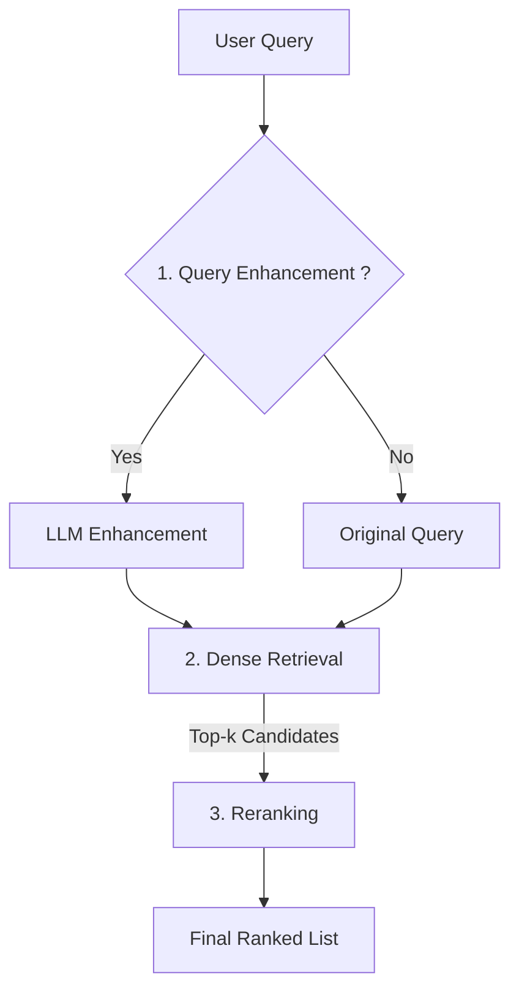

## Clinical Retrieval System (Public Demo)

Important note: this public repository demonstrates the core stages of our internal hospital search pipeline: query enhancement, dense retrieval, and reranking, implemented using public datasets.

For confidentiality, it contains no proprietary hospital code, data, or reconstructable artifacts. Key components have been refactored and adapted specifically for this public release. Consequently, this repository is a distinct codebase and is not identical to our internal production system. 

Because hospital data is sensitive and non-shareable, and the in-hospital evaluation relies on physician testing rather than a standardized public test set, this demo uses an official public substitute dataset for reproducible metrics (dataset: PubMed Central TREC CDS 2016 — see [ir-datasets — pmc/v2/trec-cds-2016](https://ir-datasets.com/pmc.html)). This demo includes a 1,000-document sample for quick runs and reproducibility. Full experiments (with metric tables) are executed on the entire public dataset and summarized in the report/README.


### Public Substitute Dataset

- PubMed Central TREC CDS 2016
  - Documents: ~1.3M (PMC v2)
  - Queries: 30
  - Qrels: ~38K
  - See the dataset page for Python API / CLI / PyTerrier examples.
  - Link: [ir-datasets — pmc/v2/trec-cds-2016](https://ir-datasets.com/pmc.html)


### System Architecture and Pipeline (retrieval pipeline identical to production)

End-to-end flow:

1. Enhance query (optional, controlled by `ENHANCE_QUERY`): rewrite the user query via an Ollama `/api/chat` endpoint to improve semantic retrieval. (For instance, a simple query like "Search for all cases of HIV brain disease" is transformed into a comprehensive, expert-level query like "Search for Brain MRI reports with findings consistent with HIV-related brain lesions, including basal ganglia lesions, opportunistic infections (e.g., toxoplasmosis, PML), HIV encephalopathy, or CNS lymphoma.")

2. Dense Retrieval: build a FAISS index over document embeddings (HF model) and perform similarity search (cosine) for the query vector to obtain top-k candidates.

3. Rerank: rerank top-k candidate documents with a cross-encoder to produce the final ranking.

<div align="center">


```mermaid
graph TD
    A[User Query] --> B{"1. Query Enhancement ?"};
    B -- Yes --> C[LLM Enhancement];
    B -- No --> D[Original Query];
    C --> E["2. Dense Retrieval"];
    D --> E;
    E -- Top-k Candidates --> F["3. Reranking"];
    F --> G[Final Ranked List];
```

</div>

### Project Structure

```
.
├── docker/
│   └── Dockerfile
├── scripts/
│   └── main.py            # entrypoint (calls src.cds2016.cli)
├── src/
│   └── cds2016/
│       ├── cli.py         # CLI pipeline
│       ├── config.py      # configuration (env overrides supported)
│       ├── data.py        # ir-datasets loading
│       ├── embeddings.py  # embeddings for queries/documents
│       ├── enhance.py     # query enhancement (LLM endpoint)
│       ├── index.py       # FAISS index build/load/search
│       ├── search.py      # dense search and BM25 hook
│       ├── rerank.py      # cross-encoder
│       └── evaluate.py    # metrics
├── docker-compose.yml
├── requirements.txt
└── LICENSE
```


### Installation (choose ONE)

Python version: 3.11.13

CUDA version: 12.4

Option A — Pip installation:

```bash
python -V   # should be 3.11.13
pip install -r requirements.txt
```

Option B — Docker (Compose) [Recommended]:

Quick start (run from project root):
```bash
cp .env.example .env  # copy env file (edit values as needed)
docker compose build
docker compose run --rm app python scripts/main.py -v
```

Details: the `Dockerfile` is in `docker/`. See the "Containerized Setup" section for more options.

Notes:

- For GPU/large models, ensure a compatible CUDA driver on the host.
- `faiss-gpu` is pinned in `requirements.txt`.

#### FAISS package: GPU/CPU switch

Default is GPU (`faiss-gpu-cu12`) via `requirements.txt`.

- CPU-only environments:

```bash
pip uninstall -y faiss-gpu-cu12 faiss-gpu
pip install -U faiss-cpu
```

- Switch back to GPU:

```bash
pip uninstall -y faiss-cpu
pip install -U faiss-gpu-cu12==1.8.0.2
```

Note: `faiss-gpu` does not automatically fall back to CPU if CUDA/GPU is unavailable. Ensure a compatible NVIDIA driver and CUDA for the pinned build.


### Quick Start

Default config targets `pmc/v2/trec-cds-2016`.

Minimal run:

```bash
python scripts/main.py
```

Run with verbosity:

```bash
python scripts/main.py -v
```

Logging behavior:
- Default (no flags): level is INFO; printed to console only.
- With `-q` (quiet): level is WARNING (show WARNING/ERROR only); printed to console only.
- With `-v` (verbose): level is DEBUG; printed to console and also written to `./logs/cds2016_YYYYMMDD_HHMMSS.log`.

Environment variables via .env (see .env.example for the full list and defaults):

```dotenv
# Data and outputs
DATASET_ID=pmc/v2/trec-cds-2016
FAISS_DIR=./artifacts/cds2016_faiss
MAX_DOCS=1000

# Models
EMBED_MODEL=Qwen/Qwen3-Embedding-8B
EMBEDDING_BATCH=2
RERANK_MODEL=BAAI/bge-reranker-v2-gemma
RERANK_METHOD=gemma
RERANK_BATCH=16

# Retrieval
RETRIEVAL_TOPK=1000
RERANK_K=1000
FINAL_K=100
EVAL_AT=10

# Device
DEVICE=cuda

# (optional) Query enhancement (Ollama /api/chat endpoint)
ENHANCE_QUERY=false
ENHANCE_ENDPOINT=http://h100:11434/api/chat
ENHANCE_MODEL=medgemma-27b-text-it:latest
```


### GPU acceleration (NVIDIA)

This project can leverage GPUs via Hugging Face Accelerate sharded loading (`device_map=auto`) for embedding and reranking models. FAISS GPU search currently uses a single device by default in this repo.

Requirements:

- Install GPU toolkits and drivers (CUDA) compatible with your PyTorch/FAISS builds
- At least one visible GPU (check with `nvidia-smi`)

How it works:

- When `DEVICE` is set to `cuda` or `gpu`, CUDA is available, and Accelerate is installed, the code sets `device_map=auto` so embedding and reranking models can shard across GPUs; otherwise `device_map` is not set and the model is moved to the specified device.
- FAISS: the index builder tries to place the flat IP index on a single GPU (ID 0). If OOM occurs, it falls back to CPU. Multi-GPU FAISS is possible but not enabled here to keep the demo simple.


Notes:

- If Accelerate is not installed, sharding is disabled automatically; the model uses a single device.
- If you see Flash Attention errors, the loader will retry without FA2; performance may change.
- Large models: prefer BF16-capable GPUs; otherwise fall back to FP16.
- Reranking is the heaviest stage. Start from a small `RERANK_BATCH` and scale up.
- FAISS OOM: the code will fall back to CPU. Alternatively, reduce `MAX_DOCS` during prototyping.


### Containerized Setup (Docker & Compose)

Start a container and run the pipeline:

```bash
# start container (detached)
docker compose up -d

# enter the container shell
docker compose exec app bash

# inside the container
python scripts/main.py -v
```

One-shot (non-interactive):

```bash
docker compose run --rm app python scripts/main.py -v
```

GPU selection via compose (excerpt from `docker-compose.yml`):

```yaml
deploy:
  resources:
    reservations:
      devices:
        - driver: nvidia
          count: all  # or device_ids: ["0", "1"]
          capabilities: [gpu]
```

Environment & caches (defined in `docker-compose.yml`):

- `.env` is loaded via `env_file: .env` (see `.env.example`)
- `HF_HOME`, `TORCH_HOME`, `KERAS_HOME` redirected to `/data/.cache` for shared caching
- Volumes:
  - `.:/workspace` live-mount the code
  - `./data/.ir_datasets:/root/.ir_datasets` for ir-datasets cache
  - `/data/.cache:/data/.cache` for model and dataset caches

Notes:

- If the container logs show GPU-related errors, verify NVIDIA toolkit installation and that the listed GPU IDs are present (`nvidia-smi`).
- The compose GPU block may require a recent Docker/Compose. If unsupported in your environment, use a single-GPU setup or run with `docker run` and `--gpus` flags.


### Sample vs Full Run

- Sample (demo): set `MAX_DOCS=1000` to quickly build FAISS, run dense retrieval and reranking, and validate E2E.
- Full (experiments): unset/clear `MAX_DOCS` to process the full dataset, rebuild the index, and run full evaluation. Scores are computed via ir-measures (nDCG@k, P@k, R@100, MAP) and summarized in tables.


### Evaluation and Results

The CLI prints evaluation metrics for each pipeline stage (e.g., Dense Search, Rerank). In our experiments, we compared several reranker models (including `BAAI/bge-reranker-v2-gemma`, `ncbi/MedCPT-Cross-Encoder`, and `Qwen/Qwen3-Reranker-8B`). This configuration defaults to using `BAAI/bge-reranker-v2-gemma`, which yielded the best performance.


#### Results

Note: The following results are from the full dataset; all values are percentages (%), shown with two decimal places; '(enhanced)' indicates query enhancement is used.

```text
| Method                               | nDCG@10 |  P@10  |  R@100  |  MAP   |
|--------------------------------------|---------|--------|---------|--------|
| Dense Search                         |  24.69  |  30.33 |  12.87  |  3.32  |
| Dense Search (enhanced)              |  22.02  |  27.00 |  13.34  |  3.42  |
| Rerank of Dense Search               |  20.33  |  23.33 |  13.37  |  3.64  |
| Rerank of Dense Search (enhanced)    |  20.31  |  25.00 |  13.52  |  3.60  |
```


#### Discussion

- **Metric Evaluation**: Dense Search demonstrates superior top-10 ranking quality (nDCG@10, P@10) compared to the reranked version. However, reranking yields a slight improvement in overall recall (R@100) and MAP.
- **Impact of Query Enhancement**: Query enhancement effectively broadens the search scope, boosting R@100 and MAP. However, it also introduces noise, which degrades the precision of top-ranked results (nDCG@10, P@10) during the dense retrieval stage.
- **Limitations and Potential Factors**:
  - A discrepancy exists between the public test set queries (long, expert-phrased sentences) and real-world clinical queries (often short and ambiguous). Consequently, the quantitative metrics may not fully capture the practical benefits of query enhancement.
  - A domain gap between the cross-encoder's pre-training data and the medical corpus compromises the precision of top-ranked results, leading to a decline in metrics like nDCG@10.


### TODO (Future Work)

- **Integrate BM25 Retrieval**:
  - In addition to the existing Dense (vector) retrieval, integrate BM25 (keyword) retrieval as an alternative path. The current codebase includes a basic interface for `pyserini`, but an index creation process has not yet been provided.

- **Implement RRF (Reciprocal Rank Fusion) for Hybrid Ranking**:
  - Develop an RRF fusion mechanism to combine ranking results from multiple sources (e.g., Dense Search, BM25, and their respective query-enhanced versions) into a single, more robust ranking.


### Privacy and Compliance

- This repository mirrors the production system’s structure, pipeline, and model settings but includes no hospital data or reconstructable artifacts.
- All demonstrations and reports use public data (`pmc/v2/trec-cds-2016`).


### References

- ir-datasets: PubMed Central (TREC CDS) — `pmc/v2/trec-cds-2016`:
  - Link: [ir-datasets — pmc/v2/trec-cds-2016](https://ir-datasets.com/pmc.html)


