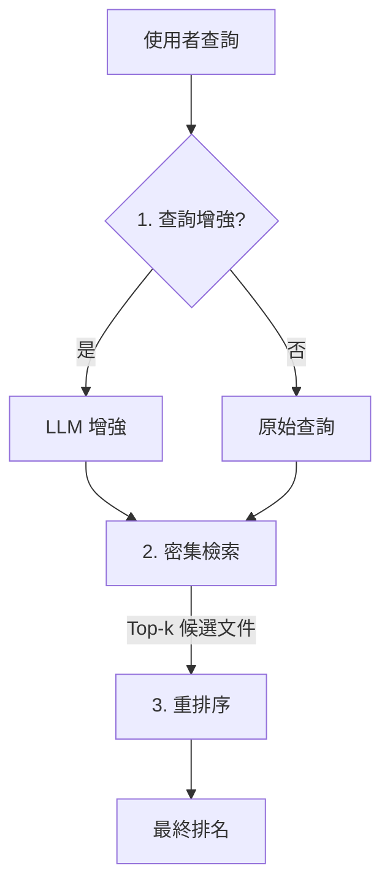

## 醫療語意搜尋系統

重要說明：此公開儲存庫為一個乾淨、開源的概念驗證 (proof-of-concept, PoC)，旨在展示一個端到端的搜尋流程，包含查詢強化 (query enhancement)、密集檢索 (dense retrieval) 及重排序 (reranking)，並僅使用公開可用的資料集。此專案為獨立開發，作為研究用途的參考架構；它不適用於臨床用途，且不包含任何雇主的程式碼、設定或資料。

為便於快速驗證，本專案提供兩種執行模式：

- Sample（展示）：預設處理前 1,000 筆文件（以 `MAX_DOCS` 控制）。
- Full（實驗）：處理完整資料集；評估指標（nDCG@k、
P@k、R@100、MAP）以 `ir-measures` 套件計算，並彙整成表格。

首次執行將自動下載資料集（PubMed Central TREC CDS 2016；參考 [ir-datasets — pmc/v2/trec-cds-2016](https://ir-datasets.com/pmc.html)）。


### 公開替代資料集

- PubMed Central TREC CDS 2016
  - 文件數：約 1.3M（PMC v2）
  - 查詢（Queries）：30
  - 相關性標註（Qrels）：約 38K
  - 官方頁面含 Python API / CLI / PyTerrier 範例
  - 連結：[ir-datasets — pmc/v2/trec-cds-2016](https://ir-datasets.com/pmc.html)

下載時間取決於網路與磁碟；此資料集的總量約 33GB，具體大小將因您使用的鏡像站點與壓縮格式而異。為確保授權合規與實驗可重現，本專案僅使用 TREC CDS 指定之 PMC 開放取用官方快照與下載連結，不另行重新封裝或散佈原文檔。


### 系統架構與流程

流程：

1. 查詢增強（可選，`ENHANCE_QUERY` 控制）：透過 Ollama 的 `/api/chat` 端點改寫使用者查詢，以提升語意檢索效果。例如，一個簡單的查詢「搜尋所有 HIV 腦病變的個案」，會被轉換成一個完整的、專家級的查詢：「搜尋腦部 MRI 報告中，與 HIV 相關腦部病灶相符之影像所見（Findings），包括基底核病灶、機會性感染（例如：弓形蟲病、進行性多灶性白質腦病 PML）、HIV 腦病變，或中樞神經系統淋巴瘤。」

2. 密集檢索：以 Hugging Face 模型產生文件向量，建立 FAISS 索引，並利用查詢向量進行餘弦相似度搜尋，取得 top-k 候選文件。

3. 重排序：以交叉編碼器對 top-k 候選文件進行重排序，得到最終排序。

<div align="center">



</div>


### 專案結構

```
.
├── docker/
│   └── Dockerfile
├── scripts/
│   └── main.py            # 執行入口（呼叫 src.cds2016.cli）
├── src/
│   └── cds2016/
│       ├── cli.py         # CLI 主流程
│       ├── config.py      # 參數設定（支援環境變數覆寫）
│       ├── data.py        # ir-datasets 載入
│       ├── embeddings.py  # 查詢/文件嵌入
│       ├── enhance.py     # 查詢強化（LLM 端點）
│       ├── index.py       # FAISS 索引（建立/載入/搜尋）
│       ├── search.py      # Dense 檢索與 BM25 介面
│       ├── rerank.py      # Cross-Encoder
│       └── evaluate.py    # 指標計算
├── docker-compose.yml
├── requirements.txt
└── LICENSE
```


### 快速入門

本節將引導您完成專案的設定與執行。請選擇 Pip 或 Docker 其中一種方式。

**先決條件**
- Python 3.11.13
- CUDA 12.4（GPU 支援）。請確保主機上已安裝相容的 CUDA 驅動程式。

#### 方案 A：Pip 安裝

1.  **設定環境變數**

    首先，複製環境變數範例檔。您可以在 `.env` 檔案中自訂模型名稱或檔案路徑等變數。
    ```bash
    cp .env.example .env
    ```

2.  **安裝依賴套件**
    ```bash
    pip install -r requirements.txt
    ```

3.  **執行流程**
    ```bash
    # 標準執行
    python scripts/main.py

    # 執行並顯示詳細日誌
    python scripts/main.py -v
    ```

#### 方案 B：Docker（推薦）

此方法使用 Docker Compose 管理環境與依賴套件。更多選項請參閱「容器化環境」一節。

1.  **設定環境變數**

    首先，複製環境變數範例檔，Docker Compose 會自動載入此檔案。
    ```bash
    cp .env.example .env
    ```

2.  **建置並執行容器**

    此指令會建置映像檔並執行主腳本。`--rm` 旗標會在執行完畢後清除容器。
    ```bash
    docker compose build
    docker compose run --rm app python scripts/main.py
    ```
    若要以詳細模式執行：
    ```bash
    docker compose run --rm app python scripts/main.py -v
    ```

### 設定說明

#### 日誌記錄行為
- 預設（不帶旗標）：等級為 INFO；僅輸出到 console。
- 使用 `-q`（quiet）：等級為 WARNING（僅顯示 WARNING/ERROR）；僅輸出到 console。
- 使用 `-v`（verbose）：等級為 DEBUG；輸出到 console，並同時寫入 `./logs/cds2016_YYYYMMDD_HHMMSS.log`。

#### FAISS 套件：GPU/CPU 切換

預設透過 `requirements.txt` 安裝 GPU 版本 (`faiss-gpu-cu12`)。

- 僅 CPU 環境：

```bash
pip uninstall -y faiss-gpu-cu12 faiss-gpu
pip install -U faiss-cpu
```

- 切換回 GPU：

```bash
pip uninstall -y faiss-cpu
pip install -U faiss-gpu-cu12==1.8.0.2
```

說明：`faiss-gpu` 在無可用 CUDA/GPU 時不會自動回落到 CPU，請確保 NVIDIA 驅動與指定的 CUDA 版本相容。

環境變數請透過 .env 設定（完整鍵值與預設值請參考 .env.example）：

```dotenv
# 資料與輸出
DATASET_ID=pmc/v2/trec-cds-2016
FAISS_DIR=./artifacts/cds2016_faiss
MAX_DOCS=1000

# 模型
EMBED_MODEL=Qwen/Qwen3-Embedding-8B
EMBEDDING_BATCH=2
RERANK_MODEL=BAAI/bge-reranker-v2-gemma
RERANK_METHOD=gemma
RERANK_BATCH=16

# 檢索
RETRIEVAL_TOPK=1000
RERANK_K=1000
FINAL_K=100
EVAL_AT=10

# 裝置
DEVICE=cuda

# （可選）查詢強化（Ollama /api/chat 端點）
ENHANCE_QUERY=false
ENHANCE_ENDPOINT=http://localhost:11434/api/chat
ENHANCE_MODEL=medgemma-27b-text-it:latest
```


### GPU 加速（NVIDIA）

此專案透過 Hugging Face Accelerate 在嵌入與重排序模型上進行 GPU 分片；FAISS 檢索目前預設走單卡。

需求：
- 安裝與 PyTorch/FAISS 版本相容的 GPU 工具包與驅動程式（CUDA）
- 至少一張可見的 GPU（可透過 `nvidia-smi` 檢查）

運作方式：
- 當 `DEVICE` 設為 `cuda` 或 `gpu` 並且已安裝 Accelerate 時，程式碼會自動設置 `device_map=auto`，使嵌入與重排序模型嘗試跨 GPU 分片；否則不使用 `device_map`（停用分片/卸載），並直接將模型移動到指定裝置。
- FAISS：索引建置器會嘗試將索引置於單一 GPU 上。若發生 OOM，則會回退至 CPU。此處未啟用 Multi-GPU FAISS 以簡化展示。


注意：

- 若未安裝 Accelerate，分片功能會自動停用；模型將使用單一裝置。
- 若遇到 Flash Attention 相關錯誤，載入器會自動在不使用 FA2 的情況下重試。
- 針對大型模型，建議使用支援 BF16 的 GPU 以獲得最佳效能；若不支援，系統將自動回退至 FP16。
- 重排序是最耗費資源的階段，建議從較小的 `RERANK_BATCH` 開始，再逐步調高。
- FAISS 因記憶體不足而發生錯誤時，系統會自動切換至 CPU 模式運行。


### 容器化環境（Docker & Compose）

啟動容器並執行流程：

```bash
# 啟動容器（背景執行）
docker compose up -d

# 進入容器 shell
docker compose exec app bash

# 在容器內執行
python scripts/main.py -v
```

或一次性執行（non-interactive）：

```bash
docker compose run --rm app python scripts/main.py -v
```

Compose GPU 選擇（節錄 `docker-compose.yml`）：

```yaml
deploy:
  resources:
    reservations:
      devices:
        - driver: nvidia
          count: all  # 或 device_ids: ["0", "1"]
          capabilities: [gpu]
```

環境與快取（定義於 `docker-compose.yml`）：

- 透過 `env_file: .env` 載入 `.env`（請參考 `.env.example`）。
- `HF_HOME`、`TORCH_HOME`、`KERAS_HOME` 重新導向至 `/data/.cache` 以共用快取。
- Volumes（掛載磁碟區）:
  - `.:/workspace`：即時掛載程式碼
  - `./data/.ir_datasets:/root/.ir_datasets`：供 ir-datasets 快取使用
  - `/data/.cache:/data/.cache`：供模型與資料集快取使用

注意：

- 若容器日誌顯示 GPU 相關錯誤，請確認 NVIDIA toolkit 已安裝，且所列的 GPU ID 確實存在（可透過 `nvidia-smi` 檢查）。
- compose 的 GPU 區塊可能需要較新版的 Docker/Compose。若您的環境不支援，請改用單一 GPU 設定，或以 `docker run` 搭配 `--gpus` 旗標執行。


### 評測與結果

命令列工具（CLI）會輸出各方法（如 Dense Search、Rerank）的評測分數。在實驗中，比較了多個重排序模型，包含 `BAAI/bge-reranker-v2-gemma`、`ncbi/MedCPT-Cross-Encoder` 與 `Qwen/Qwen3-Reranker-8B`，最終使用表現最佳的 `BAAI/bge-reranker-v2-gemma`。

#### 結果

註：以下是在完整資料集上執行的結果，數值為百分比（%），顯示至小數點後兩位；(enhanced) 表示使用查詢增強。

```text
| Method                               | nDCG@10 |  P@10  |  R@100  |  MAP   |
|--------------------------------------|---------|--------|---------|--------|
| Dense Search                         |  24.69  |  30.33 |  12.87  |  3.32  |
| Dense Search (enhanced)              |  22.02  |  27.00 |  13.34  |  3.42  |
| Rerank of Dense Search               |  20.33  |  23.33 |  13.37  |  3.64  |
| Rerank of Dense Search (enhanced)    |  20.31  |  25.00 |  13.52  |  3.60  |
```

#### 討論

- **指標評估**：
  - Dense Search 在前 10 名的排序品質（nDCG@10、P@10）優於加入重排序的版本；但重排序對整體召回（R@100）與 MAP 有小幅提升。
- **查詢增強影響**：
  - 增強查詢能有效增加搜尋廣度，提升 R@100 與 MAP，但同時也引入了噪音，降低 Dense Search 階段頂端的排序精度 (nDCG@10、P@10)。
- **限制與可能因素**：
  - 公開測試集的查詢（專家長句）與真實臨床查詢（簡短、模糊）存在差異，因此量化指標未能完全反應「查詢增強」在實務上的效益。
  - 交叉編碼器使用的預訓練資料與醫學語料之間存在知識落差（Domain Gap），這犧牲了排序頂端的精準度，導致 nDCG@10 等指標下降。

### TODO（未來工作）

- **整合 BM25 檢索**：
  - 除了現有的向量式 Dense 檢索，將再整合以關鍵字為主的 BM25 檢索做為另一條路徑。目前程式碼已包含 `pyserini` 的基本介面，但尚未提供索引建立流程。

- **實現 RRF (Reciprocal Rank Fusion) 混合排名**：
  - 開發 RRF 融合機制，將來自多個來源（如：Dense Search、BM25，以及其查詢增強版本）的排序結果，合併為單一、更穩健的排名。


### 隱私與合規

- 本專案為獨立開發的展示系統，其流程與架構可作為臨床搜尋系統的建置參考。
- 展示與報告一律使用公開資料集（`pmc/v2/trec-cds-2016`）。


### 參考

- PubMed Central (TREC CDS) — `pmc/v2/trec-cds-2016`
  - 連結：[ir-datasets — pmc/v2/trec-cds-2016](https://ir-datasets.com/pmc.html)


