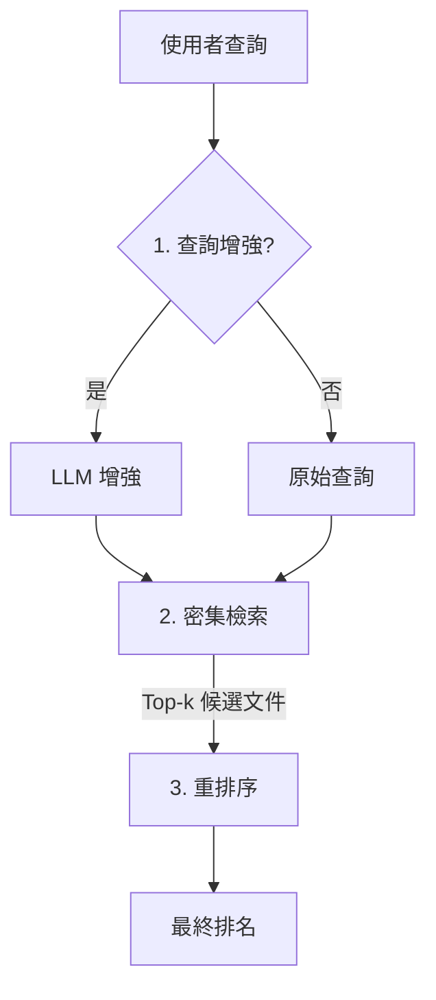

## 臨床檢索系統（公開展示版）

重要說明：此公開儲存庫 (repository) 旨在展示我們內部醫院搜尋引擎的核心流程，包含查詢強化 (query enhancement)、密集檢索 (dense retrieval) 及重排序 (reranking)，並使用公開資料集進行實作。

為保護機密資訊，本儲存庫不包含任何醫院的專有程式碼、內部資料或可重建的產物 (reconstructable artifacts)。其中，數個關鍵程式碼已進行重構與調整。因此，這是一個獨立的程式碼庫，與我們院內實際運行的版本並不完全相同。

考量院內資料的敏感性而無法對外共享，且內部評估仰賴醫師的實測，而非標準化的公開測試集，本專案因此改用官方的公開替代資料集進行可重現的量化評測（資料集：PubMed Central TREC CDS 2016；參考 [ir-datasets — pmc/v2/trec-cds-2016](https://ir-datasets.com/pmc.html)）。此專案使用 1,000 筆樣本語料用於快速重現；完整實驗則會在完整的公開資料集上執行，並以表格呈現評測指標。


### 公開替代資料集

- PubMed Central TREC CDS 2016
  - 文件數：約 1.3M（PMC v2）
  - 查詢（Queries）：30
  - 相關性標註（Qrels）：約 38K
  - 官方頁面含 Python API / CLI / PyTerrier 範例
  - 連結：[ir-datasets — pmc/v2/trec-cds-2016](https://ir-datasets.com/pmc.html)


### 系統架構與流程（檢索流程與院內一致）

端到端流程：

1. Enhance query（可選，`ENHANCE_QUERY` 控制）：透過 Ollama 的 `/api/chat` 端點改寫使用者查詢，以提升語義檢索效果。（例如，一個簡單的查詢「搜尋所有 HIV 腦病變的個案」，會被轉換成一個完整的、專家級的查詢：「搜尋腦部 MRI 報告中，與 HIV 相關腦部病灶相符之影像所見（Findings），包括基底核病灶、機會性感染（例如：弓形蟲病、進行性多灶性白質腦病 PML）、HIV 腦病變，或中樞神經系統淋巴瘤。」）

2. Dense 檢索：以 Hugging Face 模型產生文件向量並建立 FAISS 索引，對查詢向量進行相似度檢索（cosine similarity），取得 top-k 候選文件。

3. Rerank：以交叉編碼器對 top-k 候選文件進行重排序，得到最終排序。

<div align="center">


```mermaid
graph TD
    A[使用者查詢] --> B{"1. 查詢增強?"};
    B -- 是 --> C[LLM 增強];
    B -- 否 --> D[原始查詢];
    C --> E["2. 密集檢索"];
    D --> E;
    E -- Top-k 候選文件 --> F["3. 重排序"];
    F --> G[最終排名];
```

</div>


### 專案結構

```
.
├── docker/
│   └── Dockerfile
├── scripts/
│   └── main.py            # 執行入口（呼叫 src.cds2016.cli）
├── src/
│   └── cds2016/
│       ├── cli.py         # CLI 主流程
│       ├── config.py      # 參數設定（支援環境變數覆寫）
│       ├── data.py        # ir-datasets 載入
│       ├── embeddings.py  # 查詢/文件嵌入
│       ├── enhance.py     # 查詢強化（LLM 端點）
│       ├── index.py       # FAISS 索引（建立/載入/搜尋）
│       ├── search.py      # Dense 檢索與 BM25 介面
│       ├── rerank.py      # Cross-Encoder
│       └── evaluate.py    # 指標計算
├── docker-compose.yml
├── requirements.txt
└── LICENSE
```


### 安裝（擇一）

Python 版本：3.11.13

CUDA 版本：12.4

方案 A — Pip 安裝：

```bash
python -V   # 需為 3.11.13
pip install -r requirements.txt
```

方案 B — Docker（Compose）【推薦】：

快速開始（於專案根目錄執行）：
```bash
cp .env.example .env  # 複製環境檔（依需求調整內容）

docker compose build
docker compose run --rm app python scripts/main.py -v
```

說明：`Dockerfile` 位於 `docker/`。更多操作請見「容器化環境」章節。

注意：

- 若使用 GPU 與大型模型，請確認主機 CUDA 驅動相容。
- `faiss-gpu` 已在 `requirements.txt` 指定。

#### FAISS 套件：GPU/CPU 切換

預設為 GPU（`faiss-gpu-cu12`）由 `requirements.txt` 指定。

- 僅 CPU 環境：

```bash
pip uninstall -y faiss-gpu-cu12 faiss-gpu
pip install -U faiss-cpu
```

- 切回 GPU：

```bash
pip uninstall -y faiss-cpu
pip install -U faiss-gpu-cu12==1.8.0.2
```

說明：`faiss-gpu` 在無可用 CUDA/GPU 時不會自動回落到 CPU，請確保 NVIDIA 驅動與對應 CUDA 版本可用。


### 快速開始

預設資料集：`pmc/v2/trec-cds-2016`

最小化執行：
```bash
python scripts/main.py
```

顯示詳細日誌：

```bash
python scripts/main.py -v
```

日誌輸出行為：
- 預設（不帶旗標）：等級為 INFO；僅輸出到 console。
- 使用 `-q`（quiet）：等級為 WARNING（僅顯示 WARNING/ERROR）；僅輸出到 console。
- 使用 `-v`（verbose）：等級為 DEBUG；輸出到 console，並同時寫入 `./logs/cds2016_YYYYMMDD_HHMMSS.log`。

環境變數請透過 .env 設定（完整鍵值與預設值請參考 .env.example）：

```dotenv
# 資料與輸出
DATASET_ID=pmc/v2/trec-cds-2016
FAISS_DIR=./artifacts/cds2016_faiss
MAX_DOCS=1000

# 模型
EMBED_MODEL=Qwen/Qwen3-Embedding-8B
EMBEDDING_BATCH=2
RERANK_MODEL=BAAI/bge-reranker-v2-gemma
RERANK_METHOD=gemma
RERANK_BATCH=16

# 檢索
RETRIEVAL_TOPK=1000
RERANK_K=1000
FINAL_K=100
EVAL_AT=10

# 裝置
DEVICE=cuda

# （可選）查詢強化（Ollama /api/chat 端點）
ENHANCE_QUERY=false
ENHANCE_ENDPOINT=http://h100:11434/api/chat
ENHANCE_MODEL=medgemma-27b-text-it:latest
```


### GPU 加速（NVIDIA）

此專案透過 Hugging Face Accelerate 的 `device_map=auto` 在嵌入與重排序模型上進行 GPU 分片；FAISS 檢索目前預設走單卡。

需求：
- 安裝與 PyTorch/FAISS 版本相容的 GPU 工具包與驅動程式（CUDA）
- 至少一張可見的 GPU（可透過 `nvidia-smi` 檢查）

運作方式：
- 當 `DEVICE` 設為 `cuda` 或 `gpu` 且系統可用 CUDA，並且已安裝 Accelerate 時，程式碼會自動加上 `device_map=auto`，使嵌入與重排序模型嘗試跨 GPU 分片；否則不設定 `device_map`（停用分片/卸載），並直接將模型移動到指定裝置。
- FAISS：索引建置器會嘗試將 IP 索引置於單一 GPU（ID 0）上。若發生 OOM，則會回退至 CPU。此處未啟用 Multi-GPU FAISS 以簡化展示。


注意：

- 若未安裝 Accelerate，分片功能會自動停用；模型將使用單一裝置。
- 若遇到 Flash Attention 相關錯誤，載入器會自動在不使用 FA2 的情況下重試。
- 大型模型：建議使用支援 BF16 的 GPU，否則回退至 FP16。
- 重排序是最耗費資源的階段。建議從較小的 `RERANK_BATCH` 開始，再逐步調高。
- FAISS OOM：程式碼會回退至 CPU。或者，可在初步開發階段降低 `MAX_DOCS`。


### 容器化環境（Docker & Compose）

啟動容器並執行流程：

```bash
# 啟動容器（背景執行）
docker compose up -d

# 進入容器 shell
docker compose exec app bash

# 在容器內執行
python scripts/main.py -v
```

或一次性執行（non-interactive）：

```bash
docker compose run --rm app python scripts/main.py -v
```

Compose GPU 選擇（節錄 `docker-compose.yml`）：

```yaml
deploy:
  resources:
    reservations:
      devices:
        - driver: nvidia
          count: all  # 或 device_ids: ["0", "1"]
          capabilities: [gpu]
```

環境與快取（定義於 `docker-compose.yml`）：

- 透過 `env_file: .env` 載入 `.env`（請參考 `.env.example`）。
- `HF_HOME`、`TORCH_HOME`、`KERAS_HOME` 重新導向至 `/data/.cache` 以共用快取。
- Volumes（掛載磁碟區）:
  - `.:/workspace`：即時掛載程式碼
  - `./data/.ir_datasets:/root/.ir_datasets`：供 ir-datasets 快取使用
  - `/data/.cache:/data/.cache`：供模型與資料集快取使用

注意：

- 若容器日誌顯示 GPU 相關錯誤，請確認 NVIDIA toolkit 已安裝，且所列的 GPU ID 確實存在（可透過 `nvidia-smi` 檢查）。
- compose 的 GPU 區塊可能需要較新版的 Docker/Compose。若您的環境不支援，請改用單一 GPU 設定，或以 `docker run` 搭配 `--gpus` 旗標執行。


### Sample vs Full Run

- Sample（展示）：設定 `MAX_DOCS=1000`，快速建立索引並跑完整流程。
- Full（實驗）：移除/清空 `MAX_DOCS`，以完整資料集重建索引並執行評測；分數以 ir-measures（nDCG@k、P@k、R@100、MAP）計算，並彙整成表格。

### 評測與結果

CLI 會輸出各方法（如 Dense Search、Rerank）的評測分數。在實驗中，比較了多個重排序模型（包含 `BAAI/bge-reranker-v2-gemma`、`ncbi/MedCPT-Cross-Encoder` 與 `Qwen/Qwen3-Reranker-8B`），最終使用表現最佳的 `BAAI/bge-reranker-v2-gemma`。

#### 結果

註：以下是在完整資料集上執行的結果，數值為百分比（%），顯示至小數點後兩位；(enhanced) 表示使用查詢增強。

```text
| Method                               | nDCG@10 |  P@10  |  R@100  |  MAP   |
|--------------------------------------|---------|--------|---------|--------|
| Dense Search                         |  24.69  |  30.33 |  12.87  |  3.32  |
| Dense Search (enhanced)              |  22.02  |  27.00 |  13.34  |  3.42  |
| Rerank of Dense Search               |  20.33  |  23.33 |  13.37  |  3.64  |
| Rerank of Dense Search (enhanced)    |  20.31  |  25.00 |  13.52  |  3.60  |
```

#### 討論

- **指標評估**：
  - Dense Search 在前 10 名的排序品質（nDCG@10、P@10）優於加入重排序的版本；但重排序對整體召回（R@100）與 MAP 有小幅提升。
- **查詢增強影響**：
  - 增強查詢能有效增加搜尋廣度，提升 R@100 與 MAP，但同時也引入了噪音，降低 Dense Search 階段頂端的排序精度 (nDCG@10、P@10)。
- **限制與可能因素**：
  - 公開測試集的查詢（專家長句）與真實臨床查詢（簡短、模糊）存在差異，因此量化指標未能完全反應「查詢增強」在實務上的效益。
  - 交叉編碼器使用的預訓練資料與醫學語料之間存在知識落差（Domain Gap），這犧牲了排序頂端的精準度，導致 nDCG@10 等指標下降。

### TODO（未來工作）

- **整合 BM25 檢索**：
  - 除了現有的 Dense（向量）檢索，將整合 BM25（關鍵字）檢索作為另一路徑。目前程式碼已包含 `pyserini` 的基本介面，但尚未提供索引建立流程。

- **實現 RRF (Reciprocal Rank Fusion) 混合排名**：
  - 開發 RRF 融合機制，將來自多個來源（如：Dense Search、BM25，以及其查詢增強版本）的排序結果，合併為單一、更穩健的排名。


### 隱私與合規

- 本專案重現院內系統的結構、流程與模型設定，但不含任何院內資料或可重構個資的中介產物。
- 展示與報告一律使用公開資料集（`pmc/v2/trec-cds-2016`）。


### 參考

- ir-datasets: PubMed Central (TREC CDS) — `pmc/v2/trec-cds-2016`
  - 連結：[ir-datasets — pmc/v2/trec-cds-2016](https://ir-datasets.com/pmc.html)


